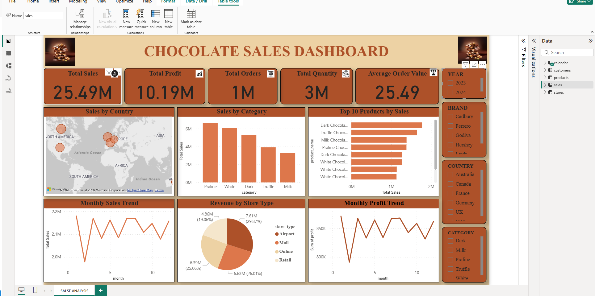

# Chocolate Sales Dashboard

An interactive Power BI dashboard analyzing chocolate sales performance across products, countries, store types, profit trends, and customer insights.

## Power BI File
[Download PBIX File](https://drive.google.com/file/d/1JDXgFHa-9KU_gzh_50rSTP9eSwyZEgVz/view?usp=sharing)

## Key Insights
- Total Sales reached 25.49M
- Total Profit reached 10.19M
- Over 1M orders were placed
- Average Order Value was 25.49
- Praline category generated the highest sales
- Airport stores contributed the most revenue
- Canada had the highest sales among countries
- Dark Chocolate products were among the top-performing products

## Dashboard Features
- KPI Cards
- Sales by Country
- Sales by Category
- Top 10 Products by Sales
- Monthly Sales Trend
- Monthly Profit Trend
- Revenue by Store Type
- Interactive Slicers

## Tools Used
- Power BI
- DAX
- Power Query
- Data Modeling

## Dashboard Preview

